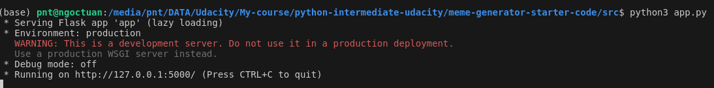

# Meme Generator
## by Ngoc Tuan Pham.

The goal of this project is to build a "meme generator" – a multimedia application to dynamically generate memes, including an image with an overlaid quote

## The application must:

- Interact with a variety of complex filetypes. Load quotes from a variety of filetypes  such as: PDF, Word Documents, CSVs, Text file.
- Accept dynamic user input.

## Setup
`pip install -r requirements.txt`

Install xpdf:

- For Linux: `sudo apt-get install -y xpdf`
- For Windows: download and install https://www.xpdfreader.com/download.html

## Running
`python3 app.py`

Access link on your browser https://localhost:5000

## Submodule

1. Meme engine module: The Meme Engine Module is responsible for manipulating and drawing text onto images. 

2. Quote engine module: This module is responsible for ingesting many types of files that contain quotes. 

`"This is a quote body" - Author`